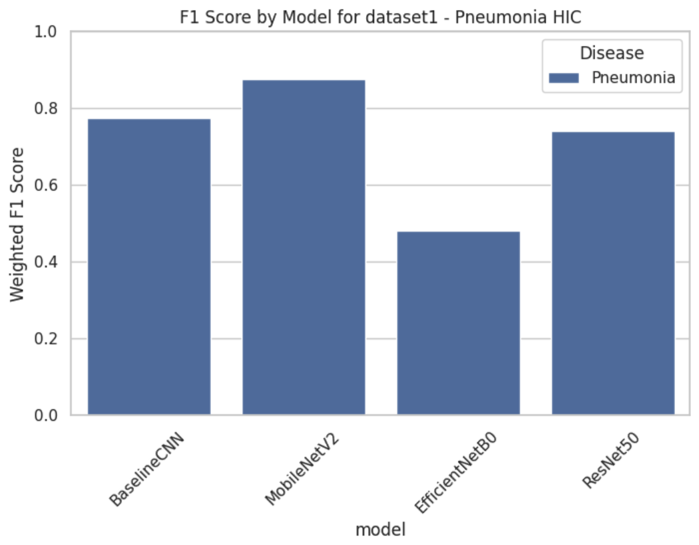
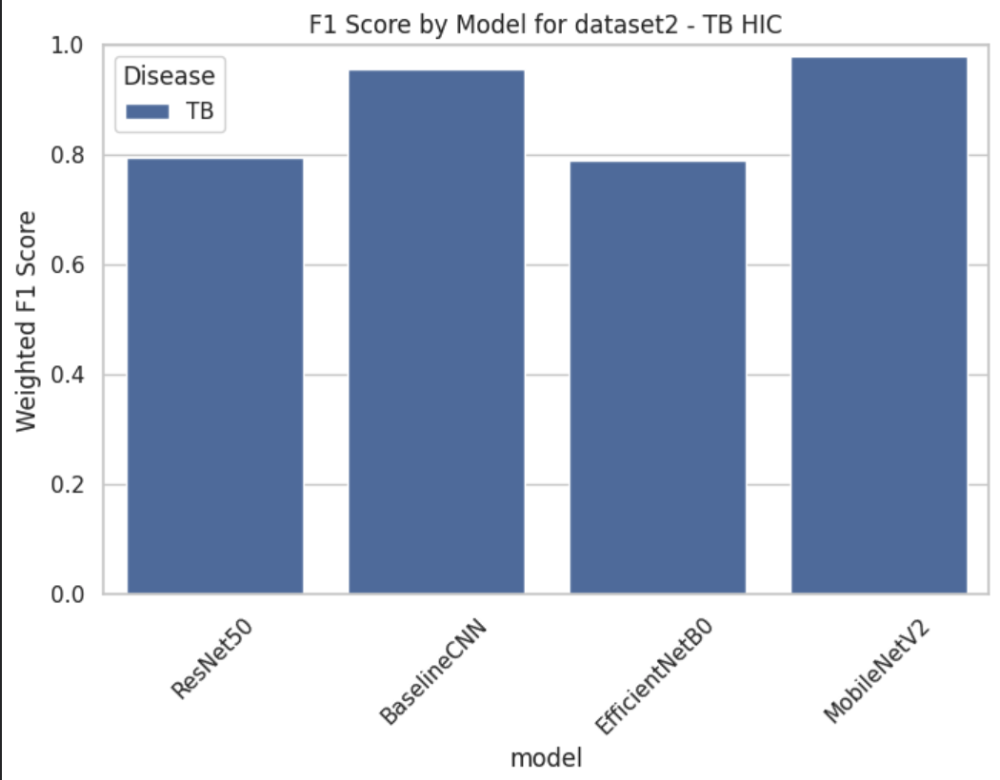
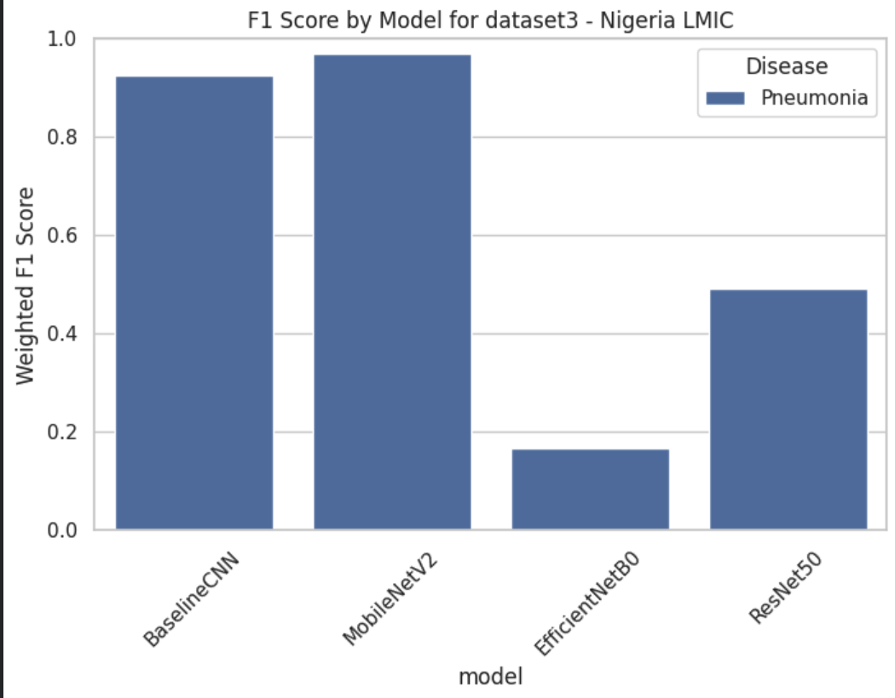
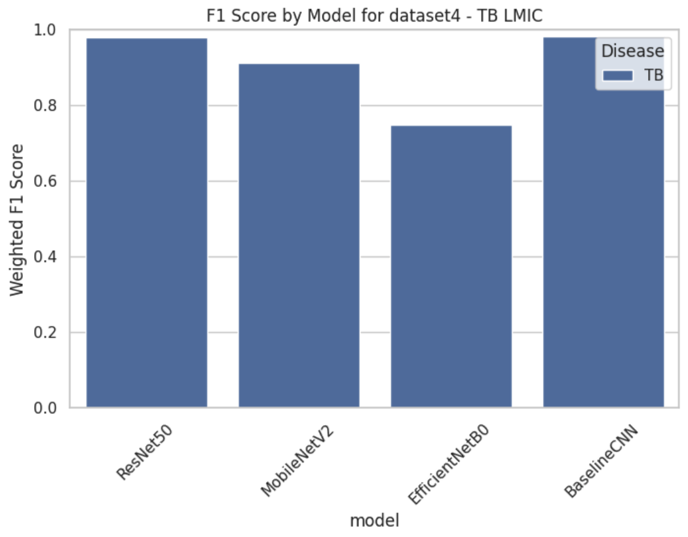
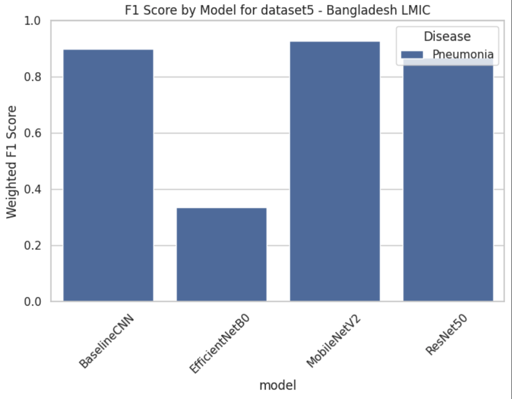
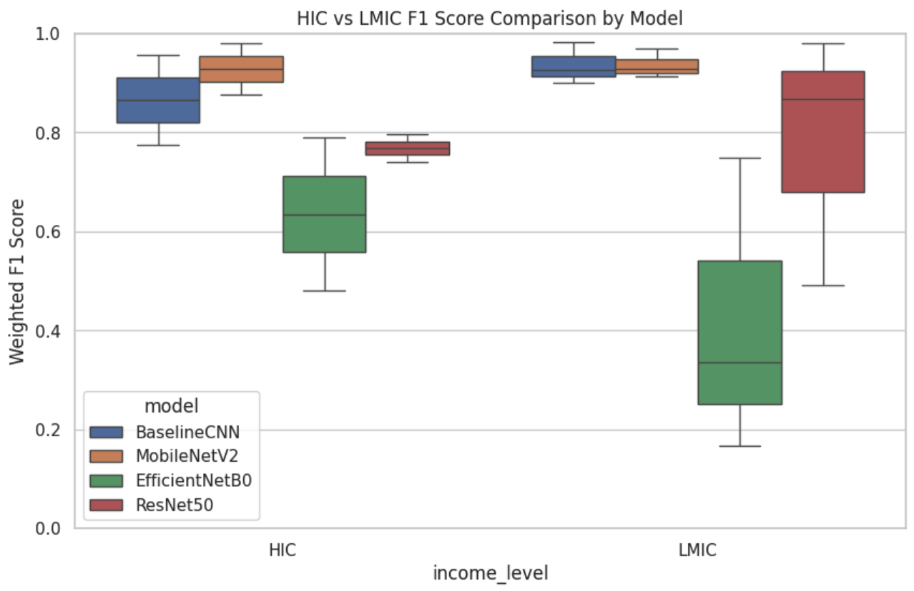
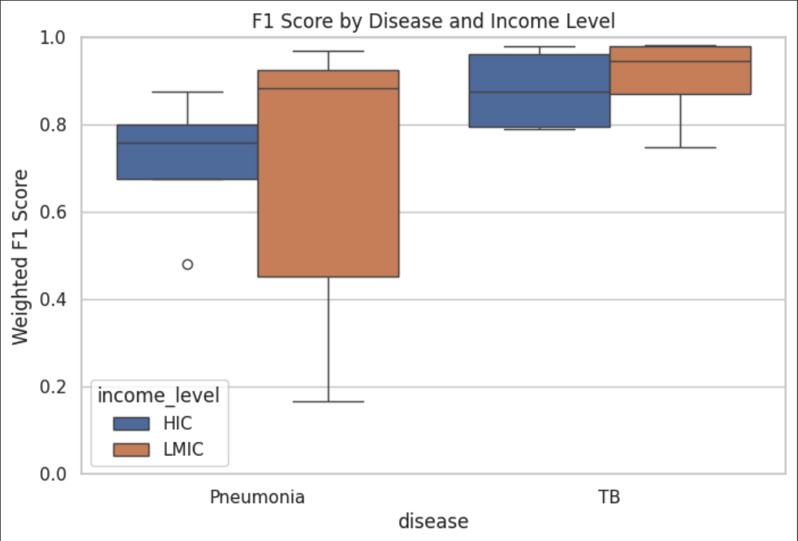
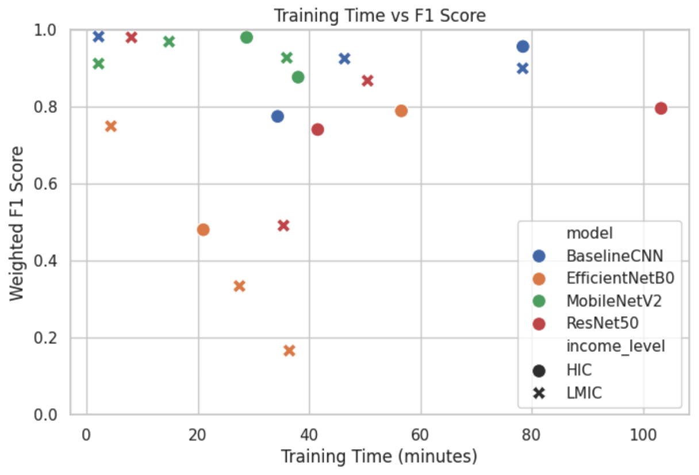
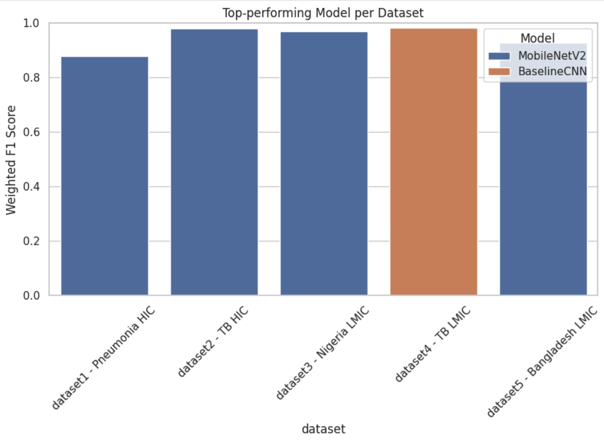

# Evaluating Deep Learning Models for Pneumonia & Tuberculosis Classification Across High- and Low-/Middle-Resource Settings

## Motivation

Most existing research relies on large, well-curated chest X-ray datasets from high-income countries, but these settings don't reflect the realities of diagnosing Pneumonia and Tuberculosis (TB) in lower and middle income countries (LMICs), where radiology expertise, imaging quality, and standardized datasets are often limited. This study systematically evaluates four deep learning models across five diverse chest X-ray datasets to understand how disease type, dataset size, class balance, and country income level influence model performance, helping identify approaches that work best in resource-constrained environments.

## Research Question

We aim to answer: How do different deep learning models (Baseline CNN, ResNet50, EfficientNet-B0, and MobileNetV2) perform in classifying Pneumonia and Tuberculosis across chest X-ray datasets from both High Income Countries (HICs) and LMICs? Which models are best suited for resource-limited settings?

To explore this, we classify chest X-rays into Healthy, Pneumonia, and Tuberculosis using the four architectures. By evaluating performance across HIC and LMIC datasets, we uncover each model's strengths and limitations, providing practical insights for designing equitable global lung disease screening systems.

## Literature Review

Deep learning has become central to automated chest X-ray analysis, particularly for Pneumonia and TB detection. CNNs consistently outperform traditional diagnostic methods by learning radiological patterns directly from images.1 Transfer learning using architectures like ResNet and EfficientNet has further boosted accuracy.1,2

However, performance varies significantly across datasets from different regions. Domain shifts due to imaging equipment, disease severity, or population differences can cause large drops in accuracy when HIC-trained models are applied in LMIC settings.3,4 Lightweight architectures like MobileNetV2 and EfficientNetB0 perform well on smaller or lower-quality datasets while requiring fewer computational resources.2 Transfer learning alone doesn't guarantee cross-regional robustness; dataset-specific factors like image quality and labeling depth remain critical.4

## Method and Implementation

We evaluated four deep learning models (Baseline CNN, MobileNetV2, EfficientNet-B0, and ResNet50) across five datasets comprising 17,624 chest X-ray images, grouped by country income level:

* **HICs:** Dataset 1 (Pneumonia)6, Dataset 2 (TB)7
* **LMICs:** Dataset 3 (Nigeria)8, Dataset 4 (TB)9, Dataset 5 (Bangladesh)10

All images were resized to 224×224 pixels and preprocessed for class balance. Each dataset was split into approximately 70% training, 15% validation, and 15% test. Models were trained with data augmentation, class weighting, Adam optimizer, categorical cross-entropy loss, early stopping, and learning rate reduction on plateau.

Performance metrics included Weighted F1-score, per-class F1-score, confusion matrices, and training time.

## Understanding F1 Score for Image Classification

A common question: isn't F1 score used for NLP tasks? Actually, F1 score is a general classification metric used whenever you're categorizing data into classes, regardless of data type. In NLP, you might classify text as positive or negative sentiment. In our case, we're classifying X-ray images as Normal, Pneumonia, or TB. Same concept, just different input data.

Think of it this way: the model looks at an X-ray image, predicts "Pneumonia," and the F1 score tells us how reliable that prediction is based on what the image actually shows. F1 score balances precision (not flagging healthy patients as sick) and recall (not missing actual disease cases), making it ideal for medical diagnosis where both false positives

## Results and Discussion

### F1 Scores per Dataset

**Dataset 1 (Pneumonia HIC):**

**Dataset 2 (TB HIC):**

**Dataset 3 (Nigeria LMIC):**

**Dataset 4 (TB LMIC):**

**Dataset 5 (Bangladesh LMIC):**

* HIC datasets (1, 2) generally showed strong performance from MobileNetV2 and Baseline CNN. EfficientNet-B0 was more sensitive to dataset characteristics and struggled across both HIC and LMIC settings.
* LMIC datasets (3, 4, 5) showed MobileNetV2 and Baseline CNN consistently performing strongly. Dataset 4 saw Baseline CNN achieve the highest score (0.965), demonstrating that simpler architectures can outperform deeper models when datasets have good balance and augmentation. EfficientNet-B0 continued to struggle in lower-quality or smaller datasets.

### 1. HICs vs LMICs Comparison

**Mean F1 Score by Model and Income Level:**
| Model | HIC Mean F1 | LMIC Mean F1 |
|-------|-------------|--------------|
| Baseline CNN | 0.851 | 0.936 |
| EfficientNetB0 | 0.584 | 0.417 |
| MobileNetV2 | 0.903 | 0.937 |
| ResNet50 | 0.763 | 0.780 |

MobileNetV2 and Baseline CNN achieved the highest F1 scores across both settings. Surprisingly, LMIC datasets matched or exceeded HIC performance for these models, likely due to better class balance, clearer disease presentations at advanced stages, and effective data augmentation. EfficientNet-B0 underperformed across both settings, indicating dataset quality and balance impact performance more than model complexity alone.

### 2. Disease Difficulty (TB vs Pneumonia)

**Mean F1 Score by Disease and Income Level:**
| Disease | HIC Mean F1 | LMIC Mean F1 |
|---------|-------------|--------------|
| Pneumonia | 0.721 | 0.719 |
| TB | 0.832 | 0.833 |

TB classification consistently achieved higher F1 scores than Pneumonia across both income levels, likely reflecting TB's more distinctive radiological patterns (cavitations, nodules, consolidations) that CNNs can readily learn. Pneumonia exhibits more variable and less specific presentations across patients, creating harder classification tasks. Performance remained remarkably consistent between HIC and LMIC settings for both diseases.

### 3. Training Time vs F1 Score

No strong linear correlation was observed between training time and F1 score. MobileNetV2 reached high F1 scores (greater than 0.80) with relatively short training times (under 100 minutes in many cases), showing that longer training doesn't automatically guarantee better performance. EfficientNet-B0 showed extended training times on some LMIC datasets but still achieved lower scores, reinforcing that model architecture and dataset characteristics matter more than training duration alone.

### 4. Best Model per Dataset

**Top Performing Models:**
| Dataset | Best Model | F1 Score |
|---------|------------|----------|
| Dataset 1 (Pneumonia HIC) | MobileNetV2 | 0.877 |
| Dataset 2 (TB HIC) | MobileNetV2 | 0.929 |
| Dataset 3 (Nigeria LMIC) | Baseline CNN / MobileNetV2 | 0.962 |
| Dataset 4 (TB LMIC) | Baseline CNN | 0.965 |
| Dataset 5 (Bangladesh LMIC) | MobileNetV2 | 0.912 |

MobileNetV2 dominated most HIC and LMIC datasets, achieving the highest or tied-highest scores in 4 out of 5 datasets. Baseline CNN outperformed all other models in Dataset 4, showing that simpler architectures can excel when data is properly preprocessed, balanced, and augmented. This challenges the assumption that deeper, more complex models always perform better.

## Conclusion

Our findings reveal that dataset characteristics (balance, disease presentation clarity, augmentation quality) drive model performance more than imaging infrastructure or country income level. LMIC datasets achieved comparable or higher F1 scores than HIC datasets (Baseline CNN: 0.936 LMIC vs 0.851 HIC; MobileNetV2: 0.937 LMIC vs 0.903 HIC), challenging conventional assumptions about resource settings and model performance.

MobileNetV2 emerged as the most robust and efficient choice across contexts, achieving high accuracy with lower computational requirements than heavier architectures. Surprisingly, our simple Baseline CNN remained highly competitive in LMIC settings, particularly excelling in the TB LMIC dataset. TB consistently outperformed Pneumonia classification across all settings, probably reflecting TB's more distinctive radiological features.

The key takeaway: dataset quality, balance, and preprocessing matter more than geographic origin or imaging equipment sophistication. This suggests practical diagnostic AI can succeed in resource-limited settings when models are properly matched to local dataset properties rather than defaulting to the most complex architectures.

## Future Work

Future research should focus on:
* Validating these patterns across larger, multi-regional LMIC datasets with varied imaging equipment and protocols
* Testing ensemble methods that combine lightweight models to improve accuracy without increasing computational demands
* Conducting prospective clinical trials in resource-limited settings to evaluate real-world diagnostic performance and physician adoption
* Exploring reverse transfer learning by training models on LMIC data and testing generalization to HIC datasets

This work establishes that effective diagnostic AI doesn't require high-end infrastructure. Properly matched models and careful dataset curation can enable successful deployment across diverse healthcare contexts.

## How to Install and Run the Project **(WARNING)**

**Disclaimer:** Running this code locally may take several hours due to computational demands. We recommend using Google Colab or the preprocessed notebook (`AA_master_analysis_all_datasets.ipynb`) for a faster, smoother experience.

## Acknowledgements

We thank ThinkingBeyond Education and its founder, Dr. Filip Bar, for making the Beyond AI Research Program 2025 accessible, along with our research mentor, Dr. Devendra Singh Dhami, our PSC mentor, Min Htet, and all volunteers for their guidance and support throughout this programme.

## Credits

**Student Researchers:** Arnav Maharjan (Main Contributor) & Ashila Atha Makkah Ardiyansyah  
**Research Mentor:** Dr. Devendra Singh Dhami

## Notes
Checkpoint saving was implemented only for Dataset 5 after we encountered runtime disconnections during earlier training sessions. We thought of this solution later in the project, so it wasn't applied to the first four datasets. This approach saves model weights after each epoch, allowing training to resume from the last checkpoint rather than restarting from scratch. While we didn't implement this feature across all datasets initially, we've included it in the codebase to demonstrate its utility for future work. This is especially valuable for resource-constrained environments like the free version of Colab, where training interruptions are common, and researchers can adopt this strategy to make their workflows more robust against crashes and runtime errors.

## References

### Literature Review References
1. Abdulkarem M, Geman O, Al-Hadhrami T, et al. Deep learning for multi-class chest disease classification using chest X-ray images. J Big Data. 2022. Available from: https://pmc.ncbi.nlm.nih.gov/articles/PMC9090861/
2. Ozturk T, Talo M, Yildirim EA, Baloglu UB, Yildirim O, Acharya UR. An explainable deep learning approach for detecting COVID-19 and pneumonia from chest X-rays. Comput Biol Med. 2021. Available from: https://pmc.ncbi.nlm.nih.gov/articles/PMC8117675/
3. Schaaf C, Maduke T, Breuninger T, et al. Performance variation of deep learning-based chest X-ray classifiers across global clinical settings: a multi-country evaluation. BMC Med Imaging. 2022. Available from: https://link.springer.com/article/10.1186/s12880-022-00793-7
4. Zhang Y, Li H, Xu C, et al. Generalization limits of deep learning for global chest X-ray diagnosis across heterogeneous imaging domains. Sci Rep. 2024. Available from: https://www.nature.com/articles/s41598-024-65703-z
5. Rahman T, Khandakar A, Kadir MA, Islam KR, Islam KF, Mahbub ZB, Ayari MA, Chowdhury MEH. Reliable tuberculosis detection using chest X-ray with deep learning, segmentation and visualization. IEEE Access. 2020;8:191586-601. doi:10.1109/ACCESS.2020.3031384. Available from: https://ieeexplore.ieee.org/stamp/stamp.jsp?arnumber=9224622

### Dataset References
6. Kermany D, Zhang K, Goldbaum M. Chest X-ray images (pneumonia) dataset. Mendeley Data. 2018. doi:10.17632/rscbjbr9sj.2. Available from: https://www.kaggle.com/datasets/paultimothymooney/chest-xray-pneumonia
7. Kiran S, Jabeen I. Dataset of tuberculosis chest X-rays images. Mendeley Data. 2024. doi:10.17632/8j2g3csprk.2. Available from: https://www.kaggle.com/datasets/tawsifurrahman/tuberculosis-tb-chest-xray-dataset
8. Musa A, et al. Nigeria chest X-ray dataset [Internet]. Kaggle; 2025 [cited 2025]. Available from: https://www.kaggle.com/datasets/aminumusa/nigeria-chest-x-ray-dataset
9. Local Pakistan Hospital. Tuberculosis chest X-ray images. Mendeley Data. 2024. doi:10.17632/8j2g3csprk.2. Available from: https://data.mendeley.com/datasets/8j2g3csprk/2
10. Hira MIK, Bithee MMA, Ahmed S, Akter L, Anonna MJM. Primary chest X-ray dataset of normal and pneumonia cases from Epic Chittagong, Bangladesh. Mendeley Data. 2025;2. doi:10.17632/wndbd5r26y.2. Available from: https://data.mendeley.com/datasets/wndbd5r26y/2

---

> The research poster for this project can be found in the [BeyondAI Proceedings 2025]().
