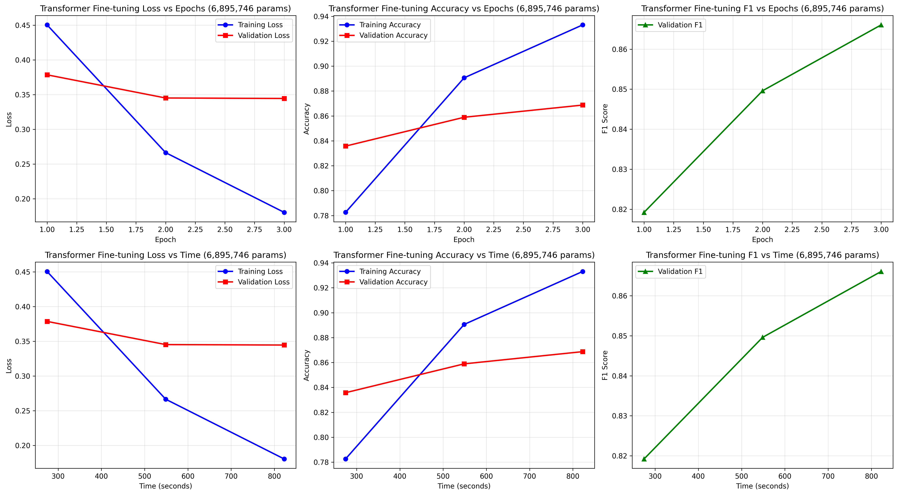
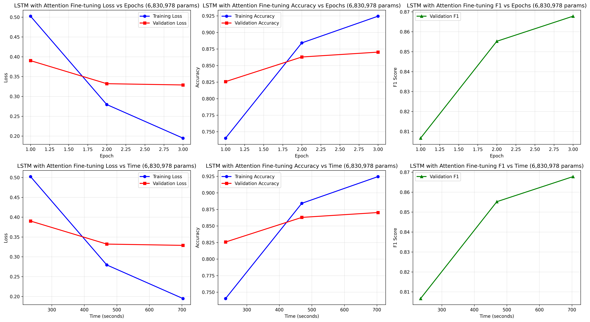

# Comparing Transformers to LSTMs with Attention

## Research Question

Under low-resource environments, how does Long Short-Term Memory (LSTM) models with attention compare to Transformers in performance and efficiency for text-based sentiment analysis? In our project, we have implemented both architectures and evaluated their performance on a binary classification task measuring metrics such as accuracy, precision, recall, F1-score. We have also varied the model sizes to assess their efficiency in different settings.

## Motivation

Currently, the use of Large Language Models (LLMs) is widespread in various applications, ranging from chatbots to content generation. However, these models often require significant computational resources, parallelization capabilities, and power. This makes them difficult to deploy in low-resource or offline settings, where latency, efficiency, and privacy are critical. Additionally, the large size of these models makes them unsuitable for local deployment on devices with limited computation resources, such as smartphones or IoT devices. This limitation hinders the potential for offline, real-time, on-device processing and also raises concerns about data privacy of users. Architectures such as LSTMs, especially when enhanced with attention mechanisms, remain significantly lighter and easier to run on constrained hardware. However, it is unclear how much performance is actually sacrificed by opting for these smaller models, or whether they may still be competitive enough for specific tasks—such as sentiment analysis—when computational resources are limited.

Our project addresses this gap by comparing LSTM with attention models and Transformer architectures across varying model sizes. By evaluating their accuracy, precision, recall, and F1-score on a binary sentiment classification task, we aim to understand the trade-off between performance and efficiency. This comparison is valuable for determining whether simpler architectures can serve as viable alternatives to Transformers in real-world, low-resource environments, enabling faster privacy-preserving, and more accessible NLP applications.

## How to run our project

To run the project, simply run all the cells in the provided Jupyter Notebook file `Comparing_Transformers_to_LSTMs_with_Attention.ipynb` in the given order. To change the hyperparameters of the models, modify the respective variables located in the Configuration section.

## Technologies and Implementation

We have implemented two different architectures for text-based sentiment analysis: Long Short-Term Memory (LSTM) models with attention and Transformer models. Both models were pre-trained on a subset of [wikipedia](https://huggingface.co/datasets/wikimedia/wikipedia) articles and evaluated on the [IMDb movie reviews dataset](https://huggingface.co/datasets/stanfordnlp/imdb), which consists of 50,000 movie reviews labeled as positive or negative.

## Model Architectures
### LSTM with Attention
The LSTM with attention model consists of an embedding layer, followed by multiple layers of bidirectional LSTM layer and multi-head attention mechanism, and finally a fully connected output layer. 
### Transformer
The Transformer model consists of an embedding layer, followed by multiple layers of self-attention and feed-forward neural networks, and finally a fully connected output layer. 

## Training and Evaluation
Both models were trained using the Adam optimizer with a learning rate of 0.001 and a batch size of 32. We have explored combinations of a small number of attention heads and layers. The models were pretrained for 8 epochs on 500 wikipedia articles, and fine-tuned using 3 epochs of 25000 IMDb movie reviews from the IMDb movie reviews dataset. The performance of the models was evaluated using accuracy, precision, recall, and F1-score metrics. The evaluation was performed on a held-out 25000 movie review test set from the IMDb dataset.

## Our results and conclusion
It is without a doubt that our conclusions are inconclusive, as the results we obtained were not consistent across different model sizes and configurations. In some cases, the LSTM with attention outperformed the Transformer, while in other cases, the Transformer performed better. This inconsistency has persisted with models having only 1 layer and 1 attention head, up to models with 2 layers and 4 attention heads. However, all models were able to achieve reasonable performance on the sentiment analysis task, with accuracy ranging from 82% to 87% depending on the model size and configuration. We have also recorded the training time for each model, and found out that there was no significant difference in training time between the two architectures with different model sizes. Our results suggest, merely for our case of text-based sentiment analysis under such low-resource environments, that there is no clear winner between LSTMs with attention and Transformers, and none has the clear advantage over the other.

Results for the Transformer model fine-tuning (4 head 2 layers variant):

Results for the LSTM with attention model fine-tuning (4 head 2 layers variant):

## Acknowledgments

We are grateful to [ThinkingBeyond](https://thinkingbeyond.education/) and the volunteers behind it for providing the opportunity and resources to learn about AI and conduct this research. We would also like to thank Dr Bar in particular, for his dedication of his personal time to equip us with the necessary knowledge and skills throughout the 4-week course stage. 
We would like to thank our mentor Dr Cief for his continuous support and guidance during the 6-week research stage.
Finally, we would like to thank our peers for their invaluable feedback and support throughout this project.

## Future Work

Our conclusions for our work are inconclusive, and there are many avenues for future work that could be explored to further investigate our research question. Some potential directions for future research include:
- **Scaling up the models**: We expect in future work that scaling up the models to include more parameters and training data could lead to more conclusive results. A larger difference in performance and training efficiency between LSTMs with attention and Transformers is expected to be observed when the models are scaled up.
- **Changing the task**: In real life scenarios, simple tasks like text sentiment analysis are rarely performed in devices with limited computational power, such as smartphones. Future work could explore more complex tasks with more significant real life applications such as local machine translation, text summarization or question answering to see further explore the differences between LSTMs with attention and Transformers in low-resource settings.
- **Exploring different variations in architectures**: Future work could explore different variations in architectures of LSTMs with attention and Transformers to see how they perform in low-resource settings. For example, future work could explore the use of different attention mechanisms, such as self-attention or multi-head attention, or different types of LSTM architectures, such as bidirectional LSTMs or stacked LSTMs and evaluating their gains or losses in performance and efficiency.
- **Tuning the hyperparameters**: Future work could explore the impact of hyperparameter tuning on the performance of LSTMs with attention and Transformers. Experiment with different optimizers, learning rates, batch sizes, dropout rates to see how they affect the performance and training efficiency of the models.

## References

LSTM with Attention:
- Luong, M. T., Pham, H., & Manning, C. D. (2015). *Effective approaches to attention-based neural machine translation*. arXiv preprint arXiv:1508.04025. [arXiv](https://arxiv.org/abs/1508.04025)
- Bahdanau, D. (2014). *Neural machine translation by jointly learning to align and translate*. arXiv preprint arXiv:1409.0473. [arXiv](https://arxiv.org/abs/1409.0473)
- Yi, J., Yu, P., Huang, T., & Xu, X. (2025, March). Advancing sentiment analysis: a novel LSTM framework with multi-head attention. In 2025 8th International Conference on Advanced Algorithms and Control Engineering (ICAACE) (pp. 2564-2567). IEEE.
[IEEE Xplore](https://ieeexplore.ieee.org/document/11020224)

Transformer:
- Vaswani, A., Shazeer, N., Parmar, N., Uszkoreit, J., Jones, L., Gomez, A. N., ... & Polosukhin, I. (2017). *Attention is all you need*. Advances in neural information processing systems, 30. [arXiv](https://arxiv.org/abs/1706.03762)
- Devlin, J., Chang, M. W., Lee, K., & Toutanova, K. (2019, June). *Bert: Pre-training of deep bidirectional transformers for language understanding*. In Proceedings of the 2019 conference of the North American chapter of the association for computational linguistics: human language technologies, volume 1 (long and short papers) (pp. 4171-4186).
[ACL Anthology](https://aclanthology.org/N19-1423/)

IMDB Dataset:
- Maas, A. L., Daly, R. E., Pham, P. T., Huang, D., Ng, A. Y., & Potts, C. (2011, June). *Learning Word Vectors for Sentiment Analysis*. Proceedings of the 49th Annual Meeting of the Association for Computational Linguistics: Human Language Technologies, 142–150. [ACL Anthology](https://aclanthology.org/P11-1015/)
---

> The research poster for this project can be found in the [BeyondAI Proceedings 2025](https://thinkingbeyond.education/beyondai_proceedings_2025/).

