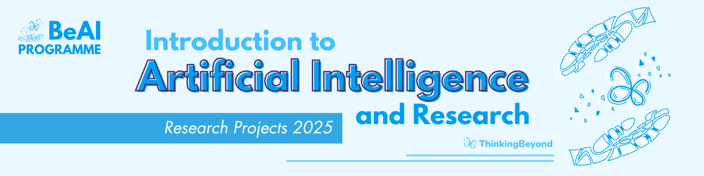

# Deep Learning Models for Diabetic Retinopathy

***Description*** 
Diabetic retinopathy is an eye disease that can lead to vision loss and blindness in people with diabetes. It is the leading cause of vision impairment in working-age adults worldwide, but early detection and treatment can prevent up to 95% of cases. Thus, it is no surprise that researchers, including those in previous BeyondAI cohorts, have turned to machine learning to facilitate early diagnosis.
2024's project by Nafiul Haque and Dr. Devendra Singh Dhami [Machiene Learning in Early Detection of Diabetic Retinopathy](https://github.com/ThinkingBeyond/BeyondAI-2024/tree/main/nafiul) focused on comparing the performance of CNNs (convolutional neural networks) and ViTs (vision transformers) on a diabetic retinopathy classification task. They found that each model had its own strengths - ViTs were better at generalization, while CNNs excelled at feature extraction. Building on their work, we studied 3 cutting-edge models to evaluate differences in *speed*, *accuracy*, and *confidence*. These models are: 

**ResNet** - ResNet is a type of CNN designed to make very deep models easier to train. Normally, when you keep adding more layers to a neural network, the gradient can become extremely small or unstable during backpropagation. This is called the vanishing/exploding gradient problem, and it causes deeper models to perform worse even though they should be more powerful. ResNet solves this by adding residual blocks with skip connections. These connections allow the input of a block to “skip” over a few layers and be added directly to the output. This helps gradients flow through the network more easily, letting the model perform well even when it has dozens or hundreds of layers.

**EfficientNet** - EfficientNet is a CNN designed to improve performance while keeping the model lightweight. Usually, increasing a network’s accuracy required making it deeper, wider, or using higher quality images, but scaling only one of these dimensions could lead to worse results. EfficientNet introduced a technique called compound scaling, which scales depth, width, and input resolution together in a balanced way. This allows the network to be more complex without slowing things down while increasing accuracy.

**MetaCLIP** - MetaCLIP is an improved way of training image–text models like CLIP. CLIP models learn by matching an image with the text that describes it, but large web datasets usually have noisy or inaccurate captions that hurt performance. MetaCLIP fixes this by using a better filtering and matching process to create image-text pairings that are more accurate. By improving the quality of the training data, the model learns stronger and more reliable connections, improving its overall accuracy even on very large datasets.

## Research Methodology

To conduct our research, we each tested a model on an EYEPACS dataset sourced from Hugging Face. The dataset contained ~35000 retinal fundus images and comprised 5 classes: (0)no_diabetic_retinopathy, (1)mild_diabetic_retinopathy, (2)moderate_diabetic_retinopathy, (3)severe_diabetic_retinopathy, and (4)proliferative_diabetic_retinopathy. Each model/network was trained on a training set (70% of the dataset) and testing on a validation set (30% of the dataset). The results were then measured through the calculation of Precision, Accuracy, and F1 scores. A comparison of the scores was then carried out to test the properties of speed, accuracy, and confidence for each label.

## Research Question

How do cutting-edge networks and models (ResNet, EfficientNet, and MetaCLIP) compare to the vanilla CNN and ViT? Additionally, what properties differentiate performance?

## Motivation

There is a real need for accurate, efficient, and effective diagnostic tools for diabetic retinopathy. However, limited clinical resources and the difficulty of identifying subtle retinal features makes screening at a large scale difficult. Each machine learning architecture has its strengths and weaknesses. We wanted to investigate whether new architectures could offer meaningful improvements in performance over traditional CNNs and vision transformers. By doing this, we hope to gain insights into which modern models are best for screening, and implement what we have learned into real-world situations through hybrid models and other solutions.

## Results

**MetaCLIP** - 
- Time: 29276.318501535003 seconds or about 8 hours
- Count: (in order) \[24636, 9946, 3, 0, 523]

- Scores:
  
  | Precision           | Precision           | Recall    | F1-Score  | Support  |
  |---------------------|---------------------|-----------|-----------|----------|
  | None                | 0.75                | 0.72      | 0.73      | 25802    |
  |---------------------|---------------------|-----------|-----------|----------|
  | Mild                | 0.00                | 0.00      | 0.00      | 0        |
  |---------------------|---------------------|-----------|-----------|----------|
  | Moderate            | 0.00                | 0.00      | 0.00      | 0        |
  |---------------------|---------------------|-----------|-----------|----------|
  | Severe              | 0.00                | 0.00      | 0.00      | 0        |
  |---------------------|---------------------|-----------|-----------|----------|
  | Proliferative       | 0.00                | 0.00      | 0.00      | 0        |

## Conclusion and Discussion

## Future Work
Future iterations of this project could cover: 
- finding and testing more properties
- development of a hybrid model with best properties of its components
- testing more, newer networks to see which one will work the best
- optimizing a model to work in low-resource settings, or with poor-quality images

## References

1.  He, K., Zhang, X., Ren, S., & Sun, J. (2016). Deep Residual Learning for Image Recognition. In 2016 IEEE Conference on Computer Vision and Pattern Recognition (CVPR) (pp. 770–778). 2016 IEEE Conference on Computer Vision and Pattern Recognition (CVPR). IEEE. [IEEE Xplore](https://doi.org/10.1109/cvpr.2016.90)
2. Tan, M., & Le, Q. V. (2019). EfficientNet: Rethinking Model Scaling for Convolutional Neural Networks. [Internet Archive](https://doi.org/10.48550/ARXIV.1905.11946)
3. Chuang, Y.-S., Li, Y., Wang, D., Yeh, C.-F., Lyu, K., Raghavendra, R., Glass, J., Huang, L., Weston, J., Zettlemoyer, L., Chen, X., Liu, Z., Xie, S., Yih, W., Li, S.-W., & Xu, H. (2025). Meta CLIP 2: A Worldwide Scaling Recipe (Version 3). [Internet Archive](https://doi.org/10.48550/ARXIV.2507.22062)
4. Gulshan, V., Peng, L., Coram, M., Stumpe, M. C., Wu, D., Narayanaswamy, A., ... & Webster, D. R. (2016). Development and validation of a deep learning algorithm for detection of diabetic retinopathy in retinal fundus photographs. Jama, 316(22), 2402-2410. [Jama Network](https://jamanetwork.com/journals/jama/fullarticle/2588763)
5. Krizhevsky, A., Sutskever, I., & Hinton, G. E. (2012). Imagenet classification with deep convolutional neural networks. In Advances in neural information processing systems (pp. 1097-1105). [NIPS](https://proceedings.neurips.cc/paper_files/paper/2012/file/c399862d3b9d6b76c8436e924a68c45b-Paper.pdf)

---

> The research poster for this project can be found in the [BeyondAI Proceedings 2025](https://thinkingbeyond.education/beyondai_proceedings_2025/).

