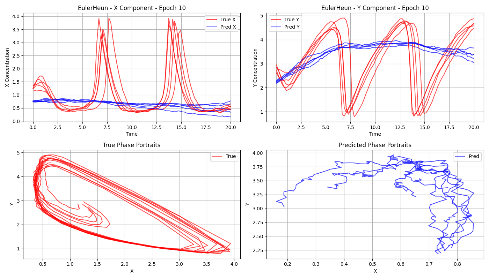

# Better Solvers Can Be Worse Learners

<div align="center">
  


</div>

## Research Question

How does the choice of numerical solver impact the learning performance of neural stochastic differential equations (NSDEs)? Conventional wisdom suggests that theoretically superior higher-order solvers should yield better learning outcomes due to their improved numerical accuracy and convergence properties. However, we investigate a counterintuitive hypothesis: **can "better" solvers paradoxically lead to worse outcomes when considering the complete picture of final model accuracy and computational efficiency?**

## Motivation

Neural SDEs are used to model complex system dynamics, yet there is little practical guidance for selecting between available solvers. Users typically default to using the most advanced solver under the assumption that higher-order solvers will provide better results. However, NSDE training is computationally costly.

**Our goal is to highlight when higher-order solvers are worth it and when they are not.**

---

## Methodology

### Experimental Design

We conducted a systematic benchmark of **nine numerical solvers** for neural stochastic differential equations, evaluating their performance across two stochastic systems of varying complexity. To ensure fair comparison, all experiments utilized identical model architectures, training configurations, and random seeds across all solver implementations.

### Model Architecture

Our Neural SDE models consist of two MLP-based neural network components:

- **Drift term** $f(t, y, x_t)$: Models the deterministic dynamics of the system
- **Diffusion term** $g(t)$: Captures the stochastic noise intensity, scaled by Brownian motion $W_t$

The neural SDE is defined as:

$$
dy_t = f(t, y_t, x_t) \, dt + g(t) \, dW_t
$$

Both systems employ **additive noise structures**, where the diffusion term does not depend on the system state, simplifying the stochastic dynamics while still capturing meaningful uncertainty.

### Benchmark Problems

#### Simple System: 1D Ornstein-Uhlenbeck Process
- Provides a baseline for solver evaluation on well-behaved, linear stochastic dynamics
- Serves as a test case for understanding when solver sophistication provides diminishing returns
- **Performance metric:** Mean Squared Error (MSE)

#### Complex System: Brusselator
- Represents challenging nonlinear dynamics with oscillatory behavior
- Tests solver performance on systems where numerical properties significantly impact learning
- **Performance metric:** Mean Absolute Error (MAE) - chosen due to gradient stability issues observed with MSE on this system

### Solver Categories

We evaluated nine solvers spanning three complexity tiers, all implemented using the [Diffrax](https://github.com/patrick-kidger/diffrax) library:

**Low-order ODE Methods:**
- `Euler`
- `Heun`
- `Midpoint`

**Low-order SDE-specific Methods:**
- `EulerHeun`
- `ItoMilstein`: Incorporates Itô stochastic calculus
- `StratonovichMilstein`: Uses Stratonovich interpretation

**High-order SDE-specific Methods:**
- `ReversibleHeun`: Reversible integration scheme
- `ShARK`: Advanced high-order method (Brusselator only, due to architectural compatibility)
- `EES25`

### Training Configuration

- **Epochs:** 250 per experiment
- **Optimizer:** Adam with standard hyperparameters
- **Random seeds:** Fixed and identical across all solver comparisons
- **Hardware:** GPU-accelerated training with continuous memory monitoring

### Evaluation Metrics

**Accuracy:**
- Mean Squared Error (OU process) or Mean Absolute Error (Brusselator) on held-out test data
- Training loss curves tracked throughout optimization

**Computational Efficiency:**
- Wall-clock training time (excluding one-time compilation overhead)
- Compilation time measured separately

**Resource Consumption:**
- Peak GPU memory usage
- Memory usage over time, sampled at 100 Hz via background monitoring process

### Experimental Controls

To isolate the effect of solver choice, we maintained constant:
- Model architecture and parameter initialization
- Dataset generation procedures and train/test splits
- Training hyperparameters (learning rate, batch size, optimization algorithm)
- Random seeds for reproducibility
- Hardware configuration and CUDA versions

This controlled experimental design ensures that observed performance differences can be attributed directly to solver selection rather than confounding factors.

---

## How to Run

This benchmark consists of three Jupyter notebooks that you can run independently. The workflow is: **(1)** run a benchmark to generate results, then **(2)** visualize those results.

### Prerequisites

Before running any notebook, ensure that you execute all `!pip install` cells at the beginning of each notebook. These will install the required dependencies.

**⚠️ Important:** Some cells contain comments about known errors and their fixes. **Read these comments carefully** before running the notebooks to avoid common issues.

### Step 1: Run a Benchmark

Choose one of the two benchmark notebooks based on the problem complexity you want to evaluate:

#### Option A: Simple System (Ornstein-Uhlenbeck Process)
```
OU.ipynb
```

- Benchmarks solvers on a 1D linear stochastic process
- Faster to run, good for initial testing
- Demonstrates that simple solvers can be sufficient for easy problems

#### Option B: Complex System (Brusselator)
```
Brusselator.ipynb
```

- Benchmarks solvers on nonlinear oscillatory dynamics
- Takes longer to run, but reveals where advanced solvers excel
- Shows the performance gap between low-order and high-order methods on challenging problems

**What happens when you run a benchmark:**
- Generates synthetic training data from the stochastic system
- Trains Neural SDE models using each of the 9 solvers
- Tracks training time, memory usage (CPU & GPU), and accuracy
- Saves results to a `results.pickle` file
- Creates individual plots in solver-specific subdirectories

**Expected Runtime:**
- OU: ~1-3 hours depending on hardware
- Brusselator: ~2-5 hours depending on hardware

### Step 2: Visualize Results

After completing a benchmark, use the plotting notebook to generate comparison visualizations:
```
plotting.ipynb
```

**Setup:**
1. Locate the `results.pickle` file generated by your chosen benchmark (OU or Brusselator)
2. Update the file path in the first cell of `plotting.ipynb` to point to your `results.pickle`
3. Run all cells

**What you'll get:**
- Training loss comparison curves across all solvers
- Bar charts comparing training time, compilation time, and total runtime
- Memory usage comparisons (both CPU and GPU peak usage)
- Memory usage over time (line plots showing dynamics during training)
- Final test loss comparison
- Time vs. memory tradeoff scatter plots

---

## Troubleshooting

### GPU Memory Tracking Issues
If you see warnings about GPU tracking being disabled, install `pynvml`:
```bash
!pip install pynvml
```
Without GPU tracking, the benchmark will still run, but won't report GPU memory usage.

---

## Tips for Faster Experimentation

- Start with fewer epochs (e.g., 50 instead of 250) to quickly test the setup
- Use a smaller dataset (`num_samples = 5000` instead of `50000`)
- Test with just 2-3 solvers first before running the complete benchmark
- Use the OU notebook first, as it's faster than Brusselator

---

## Customization

You can modify the benchmark configuration by editing the `config` dictionary in either notebook:
```python
config = {
    'num_samples': 50000,    # Number of training trajectories
    'num_epochs': 250,        # Training epochs
    'batch_size': 10000,      # Batch size
    'lr': 1e-3,              # Learning rate
    # ... other parameters
}
```

To benchmark different solvers, modify the `SOLVERS` list:
```python
SOLVERS = [
    ('Euler', diffrax.Euler),
    ('Heun', diffrax.Heun),
    # ... add or remove solvers as needed
]
```

---

## Output Structure

After running a benchmark, you'll find:
```
plots/
├── memory_multi_solver_comparison/
│   ├── all_results.pickle          # All benchmark data
│   ├── sample_path.png             # Example trajectory
│   ├── total_sample_path.png       # All training trajectories
│   ├── loss_comparison.png         # Combined loss curves
│   ├── train_time_comparison.png   # Time comparisons
│   ├── gpu_memory_comparison.png   # Memory comparisons
│   ├── gpu_memory_over_time.png    # Memory dynamics
│   └── [SolverName]/               # Per-solver results
│       ├── mse.pickle
│       ├── loss.png
│       └── model_pred*.png
```

Use `all_results.pickle` as input for `plotting.ipynb` to regenerate or customize visualizations.

---

## Conclusion

Our benchmark reveals a critical and often overlooked nuance in the selection of Neural SDE solvers: **the optimal solver is not universal, but instead conditional on the complexity of the underlying dynamics.** The experiments demonstrate a clear performance split driven by the structure of the target system.

### For Simple Systems

For simple additive-noise systems, such as the Ornstein–Uhlenbeck process, **classical low-order ODE solvers (Euler, Heun, Midpoint) perform unexpectedly well.** Despite lacking stochastic calculus, they achieve accuracy comparable to – and in some cases exceeding – the performance of advanced stochastic solvers. Crucially, they do so while providing much lower memory usage and substantially faster training times. This makes them the preferred option when computational efficiency is critical and the dynamics are not demanding.

### For Complex Systems

However, as system complexity increases (e.g., nonlinear oscillators like the Brusselator), the advantage shifts dramatically. In these regimes, the stochastic behavior becomes more structurally significant, and we observe that:

- **SDE-aware low-order solvers** (Euler–Heun, Ito–Milstein, Stratonovich–Milstein) consistently outperform ODE solvers
- **High-order stochastic schemes** (Reversible-Heun, ShARK, EES25) begin to justify their computational overhead by achieving more stable convergence and superior final accuracy

### Key Takeaway

> **Better solvers are not inherently better learners. Solver effectiveness emerges through interaction with the difficulty of the dynamics.**

Selecting the most advanced or highest-order solver by default is therefore not only suboptimal but can result in unnecessary hardware strain, longer training cycles, and reduced experiment throughput. **Users should instead match the solver to the problem difficulty.**

---

## Future Work

- Generalization to real-world datasets
- Benchmarking on larger state spaces and longer time horizons
- Investigation of adaptive solver selection strategies
- Extension to multiplicative noise and state-dependent diffusion

---

## References

1. Patrick Kidger. (2022). *On Neural Differential Equations.* arXiv:2202.02435
2. Oh et al. (2024). *Stable Neural Stochastic Differential Equations in Analyzing Irregular Time Series Data.* arXiv:2402.14989
3. Daniil Shmelev, Cristopher Salvi (2025). *Explicit and Effectively Symmetric Schemes for Neural SDEs.* arXiv:2501.20599
4. Kidger et al. (2021). *Neural SDEs as Infinite-Dimensional GANs.* NeurIPS 2021. arXiv:2102.03657
5. Oh et al. (2025). *Comprehensive Review of Neural Differential Equations for Time Series Analysis.* arXiv:2502.09885

---
